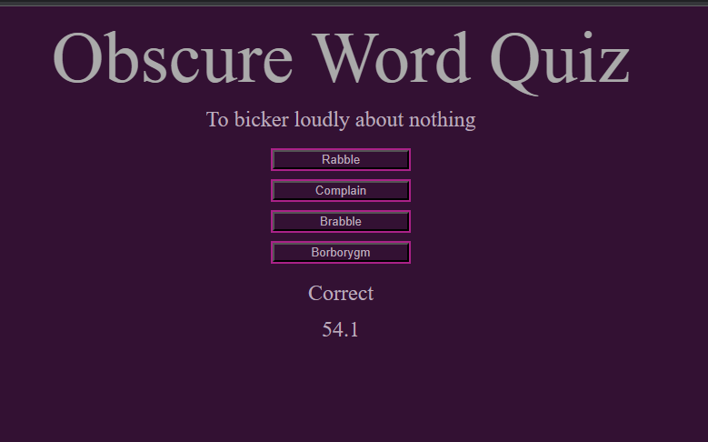

# Obscure Word Quiz

 A quiz about some obscure words in the the english language.
 
## Description

 Do you know enough to complete all 8 questions in time? You have 60 seconds to do it with a 10 second penalty for a wrong answer. If you survive all 8 questions and still have time left you can save your score on the high score board! If you don't, you will have to try again. Score board can be cleared by hitting okay when you view it. Good Luck and Have Fun!

### Preview Page

Page Link:[https://kylatae.github.io/timed-quiz/](https://kylatae.github.io/timed-quiz/) 

Repo Link:[https://www.github.com/kylatae/timed-quiz/](https://www.github.com/kylatae/timed-quiz/)

## Authors & Contributors 

Arthur Henningfield

## License

See repo

